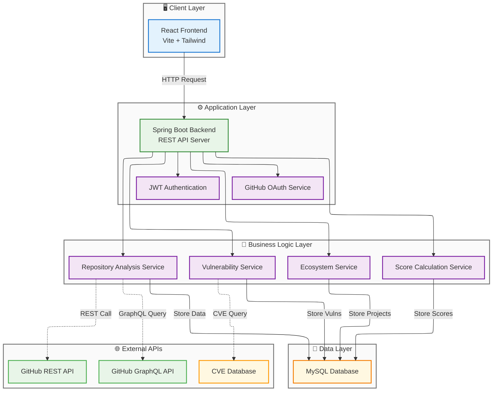

# 🏥 OSSDoctor

> Open Source Software Doctor - 오픈소스 프로젝트의 건강을 진단하고 개발자의 기여를 지원하는 플랫폼

<div align="center">


[🚀 데모 보기](#) | [🐛 이슈 제보](https://github.com/Hyeri-hci/OSSDoctor/issues)

</div>

## 📋 목차

- [🎯 프로젝트 소개](#-프로젝트-소개)
- [✨ 주요 기능](#-주요-기능)
- [🏗️ 시스템 아키텍처](#️-시스템-아키텍처)
- [🚀 빠른 시작](#-빠른-시작)
- [📱 사용 방법](#-사용-방법)
- [🛠️ 기술 스택](#️-기술-스택)
- [🤝 기여하기](#-기여하기)
- [🏆 주요 기여자](#-주요-기여자)
- [📞 지원 및 문의](#-지원-및-문의)
- [📄 라이선스](#-라이선스)

---

## 🎯 프로젝트 소개

**OSSDoctor**는 오픈소스 생태계의 건강한 발전을 위한 종합 솔루션입니다. GitHub 프로젝트의 상태를 체계적으로 분석하고, 개발자들이 자신에게 맞는 프로젝트를 찾아 기여할 수 있도록 돕는 플랫폼입니다.

### 🌟 핵심 가치

- **🔍 정확한 진단**: AI 기반 프로젝트 건강도 분석
- **👥 커뮤니티 중심**: 개발자 간 협업과 성장 지원
- **📈 성장 추적**: 개인 및 프로젝트의 발전 과정 시각화
- **♻️ OSS 지속적 활성화** : 기여와 활용의 선순환 지원
- **🎯 맞춤형 추천**: 개발자 수준과 관심사에 맞는 프로젝트 매칭

### 🎪 주요 사용자

- **🔰 신입 개발자**: 오픈소스 기여를 시작하려는 개발자
- **🏆 경험 개발자**: 새로운 프로젝트를 탐색하고 기여하려는 개발자
- **👨‍💼 프로젝트 관리자**: 프로젝트의 건강도를 모니터링하려는 관리자
- **🏢 기업**: 오픈소스 전략 수립을 위한 인사이트가 필요한 조직

---

## ✨ 주요 기능

### 🩺 프로젝트 진단 (Project Diagnosis)

<details>
<summary>상세 기능 보기</summary>

- **건강도 스코어링**: 최근 업데이트, Issue 해결율, PR 머지율 분석
- **보안 취약점 분석(개발중)**: CVE 데이터베이스 연동 실시간 취약점 검사
- **커뮤니티 활성도**: Star, Fork, Watcher, Contribution 수 분석
- **라이선스 유효성**: 프로젝트 라이선스 검사

**진단 항목:**
- ✅ 활성도 (Activity)
- ✅ 보안성 (Security)
- ✅ 유지보수성 (Maintainability)
- ✅ 커뮤니티 (Community Health)

</details>

### 🌍 생태계 탐색 (Ecosystem Explorer)

<details>
<summary>상세 기능 보기</summary>

- **지능형 프로젝트 검색**: 키워드, 언어, 난이도별 필터링
- **초보자 친화적 프로젝트**: Good First Issues 기반 추천
- **트렌딩 프로젝트**: 최신 인기 프로젝트 발견
- **기술 스택별 분류**: React, Vue, Python, Java 등 기술별 프로젝트 그룹화
- **기여 난이도 표시**: Beginner, Intermediate, Advanced 단계별 분류

**탐색 필터:**
- 🔤 프로그래밍 언어
- 📄 라이선스 타입
- 📅 최근 활동 (Last Update)
- ⚙️ 정렬 기준
  - 🐣 초보자 친화적
  - ⭐ 인기도 (Stars) 
  - ⏱️ 최근 업데이트
  - 🏷️ Good First Issue
  - 🛠️ 쉬운 기여도

</details>

### 📊 개인 활동 추적 (My Activity)

<details>
<summary>상세 기능 보기</summary>

- **기여 통계 대시보드**: Commits, Issues, Pull Requests 통계
- **경험치 시스템**: 기여에 따른 레벨업 시스템
- **뱃지 획득**: 다양한 활동 기준의 성취 뱃지
- **기여 히스토리**: 시간별 기여 활동 타임라인

**뱃지 시스템:**
- 🎯 **Initiator**: 첫 커밋 완료
- ⚡ **Routine Loader**: 꾸준한 활동
- 🔥 **Pulse Guardian**: 프로젝트 맥박을 지키는 수호자
- 👑 **Legacy Reviver**: 레거시를 되살리는 부활의 마스터

</details>

---

## 🏗️ 시스템 아키텍처


---
## 🔧 기술 스택 상세

### Frontend
- **Framework**: React 18 + Vite
- **Language**: JavaScript (ES6+)
- **Styling**: Tailwind CSS
- **State Management**: React Hooks
- **HTTP Client**: Fetch API
- **Charts**: Chart.js / D3.js
- **Icons**: Heroicons

### Backend
- **Framework**: Spring Boot 3.2
- **Language**: Java 24
- **Security**: Spring Security + JWT
- **Database**: MySQL 8.0
- **Cache**: Redis
- **API**: RESTful APIs
- **Documentation**: OpenAPI 3.0

### DevOps & Infrastructure
- **Containerization**: Docker
- **Orchestration**: Docker Compose
- **Monitoring**: Spring Boot Actuator
- **Logging**: SLF4J + Logback

---

## 🚀 빠른 시작

### 📋 사전 요구사항

- **Java 17** 이상
- **Node.js 18** 이상  
- **MySQL 8.0** 이상
- **Docker & Docker Compose** (선택사항)
- **GitHub Personal Access Token**

### 💻 로컬 개발 환경 설정

<details>
<summary>단계별 설정 가이드</summary>

#### 1. 백엔드 설정

```bash
cd backend

# 의존성 설치
./gradlew build

# (선택) 데이터베이스 설정
# 현재 개발 환경에서는 H2 인메모리 DB를 사용하므로 별도 schema.sql 파일 불필요
#mysql -u root -p < src/main/resources/schema.sql

# GitHub API 토큰 설정
cd backend
#(.env 파일 소유시 해당 파일 붙여넣기)
touch .env

# 프론트엔드 URL
echo "FRONTEND_URL=http://localhost:5173" >> .env

# GitHub OAuth App Client ID
echo "GITHUB_CLIENT_ID=your_github_client_id" >> .env

# GitHub OAuth App Client Secret
echo "GITHUB_CLIENT_SECRET=your_github_client_secret" >> .env

# GitHub Personal Access Token
echo "GITHUB_TOKEN=your_github_personal_access_token" >> .env

# JWT 서명용 비밀키
echo "JWT_SECRET_KEY=your_jwt_secret_key" >> .env

# 실행
./gradlew bootRun
```

#### 2. 프론트엔드 설정

```bash
cd frontend

# GitHub API 토큰 설정 및 backend 연결
#(.env 파일 소유시 해당 파일 붙여넣기)
touch .env

# GitHub OAuth App Client ID
echo "VITE_GITHUB_CLIENT_ID=your_github_client_id" >> .env

# GitHub OAuth Redirect URI
echo "VITE_GITHUB_REDIRECT_URI=http://localhost:5173/auth/callback" >> .env

# 백엔드 API URL
echo "VITE_BACKEND_API_URL=http://localhost:8080" >> .env

# 프론트엔드 API 기본 URL
echo "VITE_API_BASE_URL=http://localhost:5173/api" >> .env

# GitHub Personal Access Token (선택)
echo "VITE_GITHUB_TOKEN=your_github_personal_access_token" >> .env

# 의존성 설치
npm install

# 개발 서버 실행
npm run dev
```

</details>

### 🌐 접속 정보

- **프론트엔드**: http://localhost:5173
- **백엔드 API**: http://localhost:8080

### 🐳 Docker로 실행 (개발중)

```bash
# 1. 저장소 클론
git clone https://github.com/Hyeri-hci/OSSDoctor.git
cd OSSDoctor

# 2. 환경 변수 설정
cp .env.example .env
# .env 파일을 편집하여 필요한 값들을 설정

# 3. Docker Compose로 실행
#docker-compose up -d

# 4. 초기 데이터 로드 (선택사항)
#docker-compose exec backend java -jar app.jar --spring.profiles.active=init

```

---

## 📱 사용 방법

### 1️⃣ 회원가입 및 로그인

1. 메인 페이지에서 **"GitHub로 로그인"** 클릭
2. GitHub OAuth 인증 완료
3. 자동으로 사용자 프로필 생성

### 2️⃣ 프로젝트 진단

1. **"프로젝트 진단"** 메뉴 선택
2. GitHub 저장소 URL 또는 `owner/repo` 형식 입력
3. 진단 결과 확인:
   - 전체 건강도 점수
   - 세부 진단 항목별 점수
   - 개선 권장사항
   - 보안 취약점 리포트

### 3️⃣ 프로젝트 탐색

1. **"업사이클링"** 메뉴 선택
2. OSS 업사이클링 프로젝트 제안 확인
3. **"더 많은 프로젝트 선택하기"** 선택
4. 검색 필터 설정:
   - 프로그래밍 언어
   - 라이선스
   - 최근 업데이트
   - 정렬 기준
5. 관심 프로젝트 선택 및 상세 정보 확인

### 4️⃣ 개인 활동 추적

1. **"나의 기여도"** 메뉴 선택
2. 기여 통계 및 요약 확인
3. 기여 이력 확인
4. 획득한 뱃지 및 경험치 확인

---

## 📊 API 문서

### 주요 엔드포인트

#### 🔐 인증 (Authentication)
```http
POST /api/oauth/callback    # GitHub OAuth 콜백
GET  /api/oauth/status      # 로그인 상태 확인
POST /api/oauth/logout      # 로그아웃
```

#### 🩺 진단 (Diagnosis)
```http
GET /api/diagnose/{owner}/{repo}           # 전체 진단
GET /api/diagnose/{owner}/{repo}/info      # 기본 정보
GET /api/diagnose/{owner}/{repo}/security  # 보안 분석
```

#### 🌍 탐색 (Ecosystem)
```http
GET /api/ecosystem/search              # 프로젝트 검색
GET /api/ecosystem/recommended         # 추천시스템
```

#### 📊 활동 (Activity)
```http
GET /api/myactivity/stats         # 기여 통계
GET /api/myactivity/badges        # 보유 뱃지
GET /api/myactivity/history       # 기여 히스토리
GET /api/myactivity/ranking       # 전체 랭킹
```

---

## 🛠️ 개발 가이드

### 📁 프로젝트 구조

```
OSSDoctor/
├── backend/                 # Spring Boot 백엔드
│   ├── src/main/java/com/ossdoctor/
│   │   ├── controller/      # REST 컨트롤러
│   │   ├── service/         # 비즈니스 로직
│   │   ├── repository/      # 데이터 접근
│   │   ├── entity/          # JPA 엔티티
│   │   ├── dto/             # 데이터 전송 객체
│   │   ├── config/          # 설정 클래스
│   │   ├── exception/       # 커스텀 예외 처리
│   │   └── util/            # 유틸리티 클래스
│   └── src/main/resources/
│       └── application.yml  # 설정 파일
├── frontend/                # React 프론트엔드
│   ├── src/
│   │   ├── components/      # 재사용 컴포넌트
│   │   ├── features/        # 기능별 컴포넌트
│   │   ├── hooks/           # 커스텀 훅
│   │   ├── utils/           # 유틸리티 함수
│   │   └── router/          # 라우팅 설정
│   └── public/              # 정적 파일
```

### 🧪 테스트 실행

```bash
# 백엔드 테스트
cd backend
./gradlew test

# 프론트엔드 테스트
cd frontend
npm run test

# E2E 테스트
npm run test:e2e
```

---

## 🤝 기여하기

OSSDoctor 프로젝트에 기여해주셔서 감사합니다! 다음과 같은 방법으로 기여할 수 있습니다:

### 🐛 버그 리포트

1. [Issues](https://github.com/Hyeri-hci/OSSDoctor/issues)에서 기존 이슈 확인
2. 새로운 이슈 생성 시 **Bug Report** 템플릿 사용
3. 재현 단계, 예상 결과, 실제 결과 상세히 기술

### 💡 기능 제안

1. [Issues](https://github.com/Hyeri-hci/OSSDoctor/issues)에서 **Feature Request** 템플릿 사용
2. 기능의 필요성과 구현 방안 설명
3. UI/UX 목업이 있다면 첨부

### 🔧 코드 기여

1. 저장소를 Fork
2. 새로운 브랜치 생성: `git checkout -b feature/amazing-feature`
3. 변경 사항 커밋: `git commit -m 'Add amazing feature'`
4. 브랜치에 푸시: `git push origin feature/amazing-feature`
5. Pull Request 생성

### 📝 코드 스타일

- **Java**: Google Java Style Guide
- **SQL**: SQL Formatter
- **JavaScript/React**: ESLint + Prettier
- **커밋 메시지**: Conventional Commits 규약

---

## 🏆 주요 기여자

<div align="center">

| 역할 | 이름 | GitHub | 담당 업무 |
|------|------|---------|-----------|
| 🎯 **Project Lead** | 신혜리 | [@Hyeri-hci](https://github.com/Hyeri-hci) | 전체 기획 및 관리, front 개발 |
| 💻 **Backend Dev** | 정윤환 | [@Unani0528](https://github.com/Unani0528) | GitHub 연동, 보안 진단 시스템 |
| 🎨 **Backend Dev** | 진다빈 | [@dabbun](https://github.com/dabbun) | DB, 점수 계산 시스템 |

</div>

---

## 📞 지원 및 문의

### 💬 커뮤니티

- **GitHub Issues**: 버그 리포트, 기능 요청
- **GitHub Discussions**: 일반적인 질문, 아이디어 공유
- **Email**: hyeri-hci@gmail.com

---

<div align="center">

### 🌟 OSSDoctor와 함께 건강한 오픈소스 생태계를 만들어가세요!

[](https://github.com/Hyeri-hci/OSSDoctor)
[](https://github.com/Hyeri-hci/OSSDoctor)
[](https://github.com/Hyeri-hci/OSSDoctor/issues)

**[⬆ 맨 위로 돌아가기](#-ossdoctor)**

</div>
